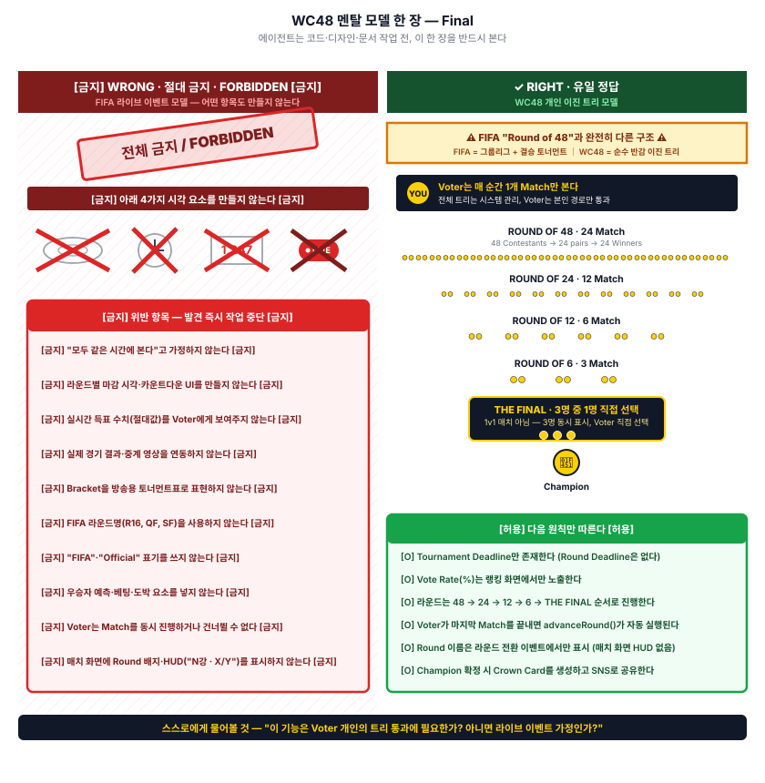

# 🛑 WorldCrown48 멘탈 모델 — 한 장

> 모든 코드·디자인·문서 작업 전, 이 한 장을 먼저 본다.
> 이 문서는 **이미지가 본체**다. 텍스트는 캡션일 뿐.



---

## 이 문서의 위치

```
docs/mental-model/
├── MENTAL_MODEL.svg   ← 본체 (정식 진실 — 시각)
├── MENTAL_MODEL.png   ← 호환용 (이미지 인식 필요 시)
└── MENTAL_MODEL.md    ← 이 파일 (이미지 컨테이너 + 진입점)
```

---

## 5분 룰

- 이 페이지 + 이미지 → **5분 안에** 읽고 이해해야 한다.
- 이해한 다음에야 다른 문서를 본다.
- 5분을 넘으면 다이어그램 디자인이 실패한 것 (피드백 환영).

---

## 작업 시작 전 자가진단

| 질문 | 답이 "예"라면 |
|------|-------------|
| 이 기능은 Voter 개인의 트리 통과에 필요한가? | ✓ 진행 |
| 라이브 이벤트(모두 같은 시간) 가정에 의존하는가? | ✗ STOP — 멘탈 모델 위반 |
| Round Deadline·Vote Count·LIVE 중계가 필요한가? | ✗ STOP — 금지 항목 |

---

## 진실의 출처 (Source of Truth)

| 영역 | 단일 출처 |
|------|---------|
| **시각 모델** (이 한 장) | `docs/mental-model/MENTAL_MODEL.svg` |
| **공식 용어** | `LANGUAGE.md` |
| **불변 원칙 8가지** | `CLAUDE.md` (대진 흐름 핵심 원칙 v0.3) |
| **구현 로직** | `docs/lite-specs/C1-vote-engine.md` |

**충돌 시 우선순위:**

```
MENTAL_MODEL.svg  >  LANGUAGE.md  >  CLAUDE.md  >  기타
```

---

## 메타 원칙

이 문서는 **새 규칙을 추가하지 않는다.** 기존 규칙(LANGUAGE.md, CLAUDE.md에 있는)을 한 장으로 시각화한 것일 뿐이다.

만약 이 문서와 다른 문서가 충돌하면 → 다른 문서가 틀린 것이거나 오래된 것이다. 다른 문서를 고쳐야 한다. (이 문서는 마지막에 의도적으로 단순화·시각화된 진실의 압축본이므로.)

---

*생성일: 2026-05-28 | Final v1*
