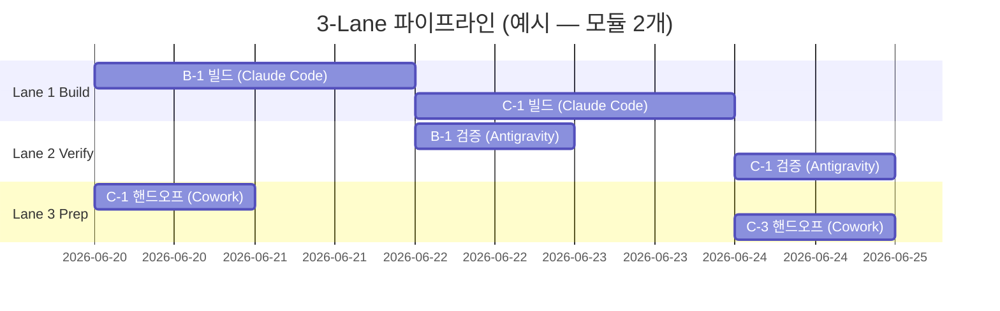
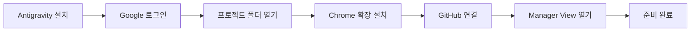
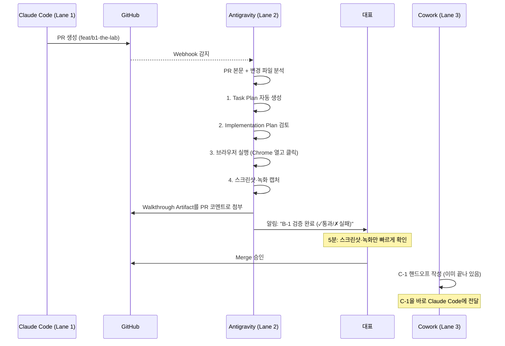

# 3-Lane Parallel Pipeline — 실행 플레이북 v1.0

> **From**: Cowork (저, 야간 준비) · **To**: 대표 (내일 아침 차분히 실행)
> **Date**: 2026-06-19 (작성), 2026-06-20 (실행 예정)
> **목표**: B-1 The Lab부터 모듈당 손실 시간 최소 30% 단축
> **위험 수준**: 중 — 첫 모듈(B-1)을 실험으로 삼고, 실증되면 표준화

---

## ⛔ 작업 전 한 줄

**이 문서를 다 읽지 않은 상태에서 어떤 명령도 실행하지 마세요.**
30분만 차분히 읽으시면 됩니다. 그 다음 §6의 체크리스트를 따라 실행하시면 자동으로 진행됩니다.

---

## §0. 왜 이 문서가 필요한가 (3분)

지금까지 모듈 한 개 끝낼 때마다 이런 식이었습니다:

```
B-1 핸드오프 작성 → B-1 빌드 → B-1 검증 → C-1 핸드오프 작성 → C-1 빌드 → ...
        ↑                                  ↑
   대표님 작업              대표님 다음 모듈 준비 못 함
```

가운데에 빈 시간(idle)이 많습니다. 한 일은 다음 일이 시작될 때까지 가만히 기다립니다.

3-Lane 파이프라인은 이것을 동시에 굴립니다:



핵심: **대표님이 잠자는 동안에도 검증과 다음 모듈 준비가 동시에 진행**됩니다.

---

## §1. Permission Settings — 자율 권한 (10분)

> 목표: Claude Code가 한 번 시작되면 작업이 끝날 때까지 대표님 승인을 묻지 않고 자율적으로 진행.

### 1.1 현재 상태 점검

대표님 프로젝트는 이미 `.claude/settings.local.json`에 다음 설정이 있습니다:

```json
{
  "permissions": {
    "defaultMode": "bypassPermissions"
  }
}
```

**이것이 의미하는 것**: Claude Code가 어떤 도구든(파일 쓰기 · 셸 명령 · 웹 요청) **물어보지 않고 바로 실행**합니다. 이것은 가장 자유로운 모드입니다.

**좋은 점**: 멈춤 없음, 진행 속도 최대.
**위험한 점**: `rm -rf` 같은 위험 명령도 막지 않음. 잘못된 명령 한 줄이 큰 사고를 부를 수 있음.

### 1.2 권장 변경 — "bypassPermissions + 안전 가드"

완전히 자유롭게 두되, **절대 해서는 안 될 일만 명시적으로 차단**합니다. 이렇게 하면 속도는 그대로 유지하면서 큰 사고만 막을 수 있습니다.

**파일**: `.claude/settings.json` (프로젝트 공용 — 커밋 대상)

```json
{
  "permissions": {
    "defaultMode": "bypassPermissions",
    "deny": [
      "Bash(rm -rf /)",
      "Bash(rm -rf ~)",
      "Bash(rm -rf $HOME)",
      "Bash(rm -rf *)",
      "Bash(git push --force origin main)",
      "Bash(git push -f origin main)",
      "Bash(git push --force-with-lease origin main)",
      "Bash(firebase deploy --only hosting:production*)",
      "Bash(firebase functions:delete*)",
      "Bash(firebase database:remove*)",
      "Bash(firebase firestore:delete*)",
      "Bash(vercel --prod)",
      "Bash(vercel rm*)",
      "Bash(npm publish*)",
      "Bash(gh repo delete*)",
      "Bash(gh release delete*)",
      "Bash(:(){ :|:& };:)"
    ],
    "ask": [
      "Bash(git push origin main*)",
      "Bash(firebase deploy*)",
      "Bash(vercel deploy*)",
      "Edit(.env*)",
      "Edit(.env.production)",
      "Edit(firebase.json)",
      "Edit(firestore.rules)",
      "Edit(storage.rules)"
    ]
  }
}
```

**이 룰의 의미**:
- `deny`: 무조건 차단. Claude가 시도해도 실행 안 됨.
- `ask`: 실행 전 대표님께 1회 확인. 배포·시크릿 같은 결정적 액션만.
- `bypassPermissions`(나머지): 모두 자동 진행.

**참고**: 평가 순서는 deny → ask → allow 순입니다. deny에 걸리면 ask·allow는 보지도 않습니다. ([공식 문서 출처](https://code.claude.com/docs/en/permissions))

### 1.3 더 안전한 대안 — "auto mode" (선택)

2026-03 Anthropic이 발표한 **Auto Mode**는 위 deny 리스트를 사람이 짜는 대신, **클래시파이어(자동 분류기)** 가 매 도구 호출마다 위험성을 판단합니다.

```json
{
  "permissions": {
    "defaultMode": "auto"
  }
}
```

**장단점**:
- 👍 deny 리스트를 일일이 짤 필요 없음
- 👍 새로운 위험 패턴도 자동으로 잡힘
- 👎 **Research Preview** (안전 보장 X, 종종 정상 명령도 막힘)
- 👎 Pro/Max/Team 플랜 한정 (Free·Anthropic API only 사용자 X — 대표님 플랜 확인 필요)

**추천**: 첫 모듈(B-1)은 **§1.2 방식(bypass + deny 가드)** 으로 진행. 안정되면 §1.3 auto로 전환 검토.

### 1.4 위험 명령 차단 훅 (선택 · 강력 추천)

`.claude/hooks/pre-bash.sh` 파일로 **차단 룰을 코드로** 추가할 수 있습니다. 예: main 직접 푸시 차단.

```bash
#!/usr/bin/env bash
# .claude/hooks/pre-bash.sh
# Claude Code가 Bash 도구를 쓸 때마다 먼저 이 스크립트가 실행됨
# exit 2 → 차단, exit 0 → 진행

CMD="$CLAUDE_TOOL_INPUT"  # Claude가 실행하려는 명령

# main에 직접 푸시 시도 차단
if echo "$CMD" | grep -qE "git push.*origin.*\bmain\b"; then
  echo "❌ main 직접 푸시 차단됨. PR로 머지하세요." >&2
  exit 2
fi

# .env.production 변경 후 자동 커밋 차단
if echo "$CMD" | grep -qE "git (add|commit).*\.env\.production"; then
  echo "❌ .env.production은 git에 올라가면 안 됩니다." >&2
  exit 2
fi

exit 0
```

훅은 **bypassPermissions 모드에서도 작동**합니다. 가장 강력한 안전장치입니다.

> 💡 훅이 처음이시면 일단 건너뛰셔도 됩니다. deny 리스트만으로도 충분합니다.

---

## §2. 에이전트 역할 분담 — 누가 무엇을 하는가 (10분)

### 2.1 한 장으로 보는 역할

```
┌─────────────────────────────────────────────────────────────────┐
│                       3-Lane Pipeline                           │
├─────────────────┬─────────────────────┬─────────────────────────┤
│   Lane 1 BUILD  │   Lane 2 VERIFY     │   Lane 3 PREP           │
│                 │                     │                         │
│   Claude Code   │   Antigravity       │   Cowork (저)           │
│   (실코드 생성) │   (검증·테스트)     │   (다음 핸드오프 작성)  │
│                 │                     │                         │
│ • worktree 분리 │ • PR 자동 리뷰      │ • lite-spec 정리        │
│ • TDD 진행      │ • 브라우저 테스트   │ • 의사결정 메모 통합    │
│ • PR 생성       │ • Walkthrough 작성  │ • Self-verify 작성      │
│ • 자가 검증     │ • 통과/실패 리포트  │ • 위험 요소 사전 식별   │
│                 │                     │                         │
│ 입력: 핸드오프  │ 입력: PR URL        │ 입력: 대표 결정         │
│ 출력: PR        │ 출력: Artifact      │ 출력: 핸드오프 v2.0     │
└─────────────────┴─────────────────────┴─────────────────────────┘
                              │
                              ▼
                  ┌──────────────────────┐
                  │   대표 (검수자)      │
                  │ • 의사결정 (5분/일)  │
                  │ • PR 머지 승인       │
                  │ • 다음 lane 출발 신호│
                  └──────────────────────┘
```

### 2.2 각 에이전트 상세 — "무엇 · 어떻게 · 왜"

#### Lane 1: Claude Code (Builder)

**무엇**: 핸드오프 브리프를 받아 실제 코드를 작성하고 PR을 만듭니다.

**어떻게**:
1. 대표님이 핸드오프 브리프(`docs/handoffs/B1-the-lab-handoff.md`)를 Claude Code에 전달
2. Claude Code가 git worktree(별도 폴더에서 같은 저장소의 다른 브랜치로 작업)에 자동 진입
3. §0 Self-verify 통과 → 코드 작성 → 테스트 작성 → 커밋 → PR 생성

**워크트리 생성 명령** (대표님이 실행):
```bash
# B-1용 워크트리 생성
git worktree add ../wc48-b1 -b feat/b1-the-lab

# 새 폴더로 이동해 Claude Code 시작
cd ../wc48-b1
claude
```

**왜 worktree?**: 한 프로젝트에서 여러 모듈을 동시에 작업할 때 폴더가 섞이지 않게 합니다. B-1 작업하던 중에 C-1 핸드오프를 보고 싶으면 그냥 폴더만 바꾸면 됩니다. **권장 동시 worktree 수: 2~3개 이상은 피로감 ↑.**

#### Lane 2: Antigravity (Verifier)

**무엇**: Claude Code가 만든 PR을 자동으로 받아 **브라우저로 직접 테스트**하고, 결과를 사람이 읽기 쉬운 Walkthrough(워크스루 — 실행 일지) 문서로 남깁니다.

**왜 Antigravity가 검증에 강한가**:
- Google의 에이전트 IDE. Claude Sonnet 4.6·Opus 4.6 모델을 그대로 사용 가능 ([공식 발표](https://developers.googleblog.com/build-with-google-antigravity-our-new-agentic-development-platform/))
- **Artifact 시스템**: 모든 에이전트 실행이 끝나면 Task Plan → Implementation Plan → Walkthrough(스크린샷·녹화 포함) 3종 산출물 자동 생성 ([Antigravity Lab AI Code Review Guide](https://antigravitylab.net/en/articles/editor/ai-code-review))
- **브라우저 자동화 내장**: Antigravity는 Chrome을 직접 제어해서 "회원가입 → 토너먼트 생성 → 투표"까지 사용자 시점으로 클릭해보고 스크린샷을 남김
- **Manager View**: 최대 5개 에이전트 병렬 실행 ([Wikipedia: Google Antigravity](https://en.wikipedia.org/wiki/Google_Antigravity))

**구체 사용법은 §3에서.**

#### Lane 3: Cowork (저, Brief Writer)

**무엇**: Claude Code가 N번 모듈을 빌드하는 동안, 저는 N+1번 모듈의 핸드오프 브리프를 미리 작성합니다.

**왜 Cowork이 이 역할?**:
- 저는 코드를 짜는 데 최적화되어 있지 않고, **문서·분석·의사결정 정리**에 최적화 ([기억: Tool role division](claude-design.md 참조))
- 대표님과 같은 화면(Slack·Notion·메모리) 에서 결정 사항을 추적
- Lite-spec ↔ 상위 기획서 정합 검증 가능 ([기억: 상위·하위 사양 정합 검증])

**산출물**: 매 모듈 종료 직전, 다음 모듈의 핸드오프 v2.0 (§0 Self-verify 포함, §11 Superpowers TDD 포함, lite-spec 충돌 표시 포함)

---

## §3. Antigravity를 검증 에이전트로 쓰는 법 — 단계별 (15분)

> ⚠️ **솔직한 고지**: 저는 이 프로젝트에서 Antigravity를 실제로 운영해본 기록이 없습니다. 아래 절차는 2026-06-19 기준 공식 문서·튜토리얼 종합입니다. 첫 실행 시 다음과 같은 작은 변형이 있을 수 있으니, 막히면 §5 트러블슈팅을 보세요.

### 3.1 사전 준비 — 1회만



**Step 1 — Antigravity 다운로드** (10분)

https://antigravity.google 에서 무료 다운로드. macOS / Windows / Linux 모두 지원. (VS Code의 fork이므로 VS Code 사용 경험이 있으면 바로 익숙합니다.)

**Step 2 — Google 계정 로그인** (2분)

대표님이 K운세·월크48에 쓰시는 Google 계정으로 로그인. Public Preview는 무료.

**Step 3 — 모델 설정** (1분)

상단 우측 모델 선택 드롭다운 → **Claude Sonnet 4.6**(코딩 정확도 우선) 또는 **Claude Opus 4.6**(복잡한 검증 우선) 선택.
설정 → API Keys → Anthropic Console에서 받은 API 키 입력. ([기억: API 키 보안] — 키 입력 시 채팅·스크린샷 금지)

**Step 4 — 프로젝트 폴더 열기** (1분)

`File → Open Folder` → `/Users/jinii/Projects/worldcrown48` 선택.

**Step 5 — Chrome 확장 설치** (3분)

Antigravity가 "Install Chrome Extension" 알림을 띄울 때 수락. 이 확장이 있어야 **브라우저 자동화 검증**(스크린샷·녹화)이 됩니다. ([출처: How to Use Antigravity for Automated Code Reviews](https://skywork.ai/blog/agent/antigravity-code-review/))

**Step 6 — GitHub PR 연결** (2분)

설정 → Integrations → GitHub → `choijinii/worldcrown48` 저장소에 권한 부여. 이걸 해야 PR이 생성되면 자동으로 감지합니다.

**Step 7 — Manager View 켜기** (1분)

상단 메뉴 → View → Manager. 이것이 여러 에이전트를 동시에 보는 관제실입니다.

### 3.2 1회 검증 사이클 — 매 PR마다



**구체 단계**:

1. **Claude Code(Lane 1)가 PR 생성**
   대표님 개입 없음. Claude Code는 자율 진행.

2. **Antigravity Manager View에서 "New Agent" 클릭**
   - Task: "Review PR #N — Test the feature in browser and report"
   - Agent Type: **Code Review Agent** (Antigravity 내장 역할)
   - Workspace: 자동으로 `feat/b1-the-lab` 브랜치 체크아웃

3. **Antigravity가 단계별로 진행**
   - Task Plan 생성 → PR 변경 사항 요약
   - Implementation Plan 검토 → 핸드오프 브리프와 대조
   - 로컬에서 `npm run dev` 실행 → Chrome 자동 열림
   - "회원가입 → /admin/lab → Tournament 생성" 시나리오 자동 클릭
   - 각 단계 스크린샷 저장
   - 에러 발견 시 PR에 즉시 코멘트

4. **Walkthrough Artifact 생성**
   결과 문서가 자동으로 다음 위치에 저장:
   ```
   .antigravity/walkthroughs/B1-the-lab-2026-06-21.md
   ```
   안에는: 시나리오, 스크린샷 4~6장, 발견 이슈, 통과 여부.

5. **대표님 확인 (목표: 5분 이내)**
   - PR 페이지의 Antigravity 코멘트 펼치기
   - 스크린샷 3~4장 확인
   - 통과 표시 → Merge

### 3.3 Antigravity가 실패를 발견했을 때

Antigravity가 PR에 "✗ Failed at step 3: Tournament 생성 후 redirect 안 됨"이라고 코멘트하면:

**선택지 A — 같은 PR에 추가 작업**
PR에 "@claude please fix the redirect issue described by Antigravity in comment above"로 코멘트. Claude Code가 자동으로 이어서 작업.

**선택지 B — Antigravity가 직접 수정**
Antigravity Manager에서 같은 에이전트에게 "Fix the failing step yourself" 지시. Antigravity가 새 커밋 푸시.

**대표님 결정 기준**:
- 수정 범위가 **명확하고 작음** → B (빠름)
- 설계 변경이 필요 → A (Claude Code가 핸드오프 참조 가능)

### 3.4 Antigravity가 안 맞을 때의 Fallback

Antigravity 통합이 첫 모듈에서 어색하다면:

```
Lane 2 (Verify) Fallback:
  Antigravity 대신 → Cowork(저)이 Vercel Preview URL을 받아
  PR 검증 리포트를 텍스트로 작성. 브라우저 자동화는 빠지지만
  사용자 시나리오 검증은 가능.
```

이 fallback도 §6 체크리스트에 포함돼 있으니 안심하셔도 됩니다.

---

## §4. 워크트리 가드레일 — 모듈 간 사고 방지 (5분)

### 4.1 동시 세션의 함정

Git worktree는 **파일은 분리**되지만 다음 4가지는 공유합니다:

| 공유되는 것 | 위험 | 대응 |
|---|---|---|
| 로컬 Firebase 에뮬레이터 포트 | 두 세션이 같은 포트 → 충돌 | 워크트리별 `firebase.json` 포트 다르게 |
| `.env.local` | 한쪽 변경이 다른쪽 영향 | 워크트리별 `.env.local` 복사본 |
| `node_modules` | 버전 충돌 가능 | 워크트리마다 `npm install` 따로 |
| Vercel 환경변수 | Preview 환경 공유 | 브랜치별 Preview URL 자동 분리됨 (Vercel) |

### 4.2 워크트리 시작 스크립트

`scripts/new-worktree.sh` 를 만들면 매번 안전하게 시작할 수 있습니다.

```bash
#!/usr/bin/env bash
# scripts/new-worktree.sh
# 사용: bash scripts/new-worktree.sh b1 the-lab

MODULE_ID=$1   # 예: b1
MODULE_NAME=$2 # 예: the-lab
BRANCH="feat/${MODULE_ID}-${MODULE_NAME}"
TARGET="../wc48-${MODULE_ID}"

if [ -d "$TARGET" ]; then
  echo "❌ $TARGET 이미 존재. 정리 후 다시 실행."
  exit 1
fi

git worktree add "$TARGET" -b "$BRANCH"
cd "$TARGET"
cp "../worldcrown48/.env.local" ".env.local"
npm install
echo "✅ 준비 완료. 다음을 실행하세요:"
echo "  cd $TARGET"
echo "  claude"
```

### 4.3 종료 시 정리

PR 머지 후:
```bash
git worktree remove ../wc48-b1
git branch -d feat/b1-the-lab
```

머지하지 않으면 worktree가 계속 디스크 차지합니다.

---

## §5. 트러블슈팅 — 자주 막히는 지점 (참조용)

| 증상 | 원인 가능성 | 첫 시도 |
|---|---|---|
| Claude Code가 권한 모달을 띄움 | settings.local.json 무시됨 | `claude --dangerously-skip-permissions` 명시 실행 |
| Antigravity가 모델을 못 찾음 | Anthropic API 키 미입력 | Settings → API Keys 재입력 |
| Antigravity Chrome 자동화 실패 | 확장 미설치 또는 권한 거부 | chrome://extensions 에서 활성화 |
| PR이 Antigravity에 안 보임 | GitHub 권한 부족 | Integrations → GitHub → repo 권한 재승인 |
| 두 worktree가 같은 포트 충돌 | Firebase 에뮬레이터 동일 포트 | 워크트리별 `firebase.json` port 변경 |
| `.env.local` 한쪽 변경이 다른쪽 영향 | symbolic link로 연결됨 | `cp -L`로 실제 복사본 사용 |

---

## §6. 내일 아침 실행 체크리스트 (30분 — 천천히)

> **순서대로 ✓ 하나씩 체크하시면 됩니다. 막히면 멈추고 메모만 남겨주세요.**

### Phase A — Permission 설정 (10분)

- [ ] **A-1**: 현재 `.claude/settings.local.json` 백업
  ```bash
  cp .claude/settings.local.json .claude/settings.local.json.bak
  ```
- [ ] **A-2**: §1.2 내용을 `.claude/settings.json` (공용)에 저장
- [ ] **A-3**: `claude` 실행 → "Hello"라고 인사 시켜보기 → 정상 응답이면 OK
- [ ] **A-4**: (선택) `.claude/hooks/pre-bash.sh` 생성 후 실행권한
  ```bash
  chmod +x .claude/hooks/pre-bash.sh
  ```

### Phase B — Antigravity 1회 셋업 (20분)

- [ ] **B-1**: https://antigravity.google 에서 다운로드·설치
- [ ] **B-2**: Google 계정 로그인
- [ ] **B-3**: Anthropic API 키 입력 (Claude Sonnet 4.6 모델 선택)
- [ ] **B-4**: `worldcrown48` 폴더 열기
- [ ] **B-5**: Chrome 확장 설치 알림 수락
- [ ] **B-6**: GitHub 연결 (choijinii/worldcrown48 권한 부여)
- [ ] **B-7**: Manager View 열어 빈 화면 확인

### Phase C — B-1 핸드오프 받기 (5분)

- [ ] **C-1**: 저(Cowork)에게 "B-1 핸드오프 작성 시작" 메시지
  → 제가 `docs/handoffs/B1-the-lab-handoff.md` v2.0 작성
- [ ] **C-2**: 작성 완료되면 §0 Self-verify 한 번 읽어보기
- [ ] **C-3**: 의문점·결정 필요 항목 5분 확인

### Phase D — Lane 1·2·3 동시 가동 (5분 설정 후 자동)

- [ ] **D-1**: 워크트리 생성
  ```bash
  bash scripts/new-worktree.sh b1 the-lab
  ```
- [ ] **D-2**: 새 폴더에서 Claude Code 시작 → 핸드오프 첨부
- [ ] **D-3**: Antigravity Manager View → "New Agent — Watch PR feat/b1-the-lab"
- [ ] **D-4**: 저(Cowork)에게 "C-1 핸드오프 미리 시작" 메시지
- [ ] **D-5**: ☕ 잠시 휴식. 모든 lane이 자율 진행 중.

---

## §7. 위험 등록부 (Risk Register)

| 위험 | 확률 | 영향 | 대응 |
|---|---|---|---|
| Antigravity 첫 셋업이 30분 이상 걸림 | 중 | 작음 | §3.4 Fallback (Cowork이 텍스트 검증) |
| bypassPermissions가 위험 명령 실행 | 낮 | 큼 | §1.2 deny 리스트 + §1.4 훅 |
| 두 worktree가 Firebase 충돌 | 중 | 중 | §4.1 표 — 포트 분리 |
| Antigravity가 Anthropic API 비용 폭증 | 낮 | 중 | Anthropic Console에서 일 한도 설정 |
| Claude Code가 main에 직접 푸시 | 낮 | 큼 | §1.4 훅 + GitHub Branch Protection |

---

## §8. 다음 단계 (B-1 종료 후 회고)

- [ ] Antigravity Walkthrough 품질 자체 평가 (스크린샷 정확도, 시나리오 커버리지)
- [ ] 3-Lane 동기화 시간 측정 (실제로 얼마나 단축됐는가)
- [ ] C-1에서 표준화할지, Lane 2를 Cowork으로 되돌릴지 결정
- [ ] 본 플레이북 v1.1로 업데이트

---

## 출처 (Sources)

- [Build with Google Antigravity — Google Developers Blog](https://developers.googleblog.com/build-with-google-antigravity-our-new-agentic-development-platform/)
- [Antigravity 2.0 at Google I/O 2026 — Veduis](https://veduis.com/blog/google-antigravity-2-update-guide/)
- [AI Code Review Guide — Antigravity Lab](https://antigravitylab.net/en/articles/editor/ai-code-review)
- [How to Use Antigravity for Automated Code Reviews — Skywork](https://skywork.ai/blog/agent/antigravity-code-review/)
- [Configure Permissions — Claude Code Docs](https://code.claude.com/docs/en/permissions)
- [Claude Code Auto Mode — Anthropic Engineering](https://www.anthropic.com/engineering/claude-code-auto-mode)
- [Run Multiple Claude Code Sessions in Parallel With Git Worktrees — MindStudio](https://www.mindstudio.ai/blog/claude-code-git-worktree-parallel-branches)
- [Parallel Agents in Antigravity — Mete Atamel](https://atamel.dev/posts/2026/01-19_parallel_agents_antigravity/)

---

*© 2026 WorldCrown48 | Operations Playbook v1.0 | 작성: Cowork | 검수 대기 — 대표*
